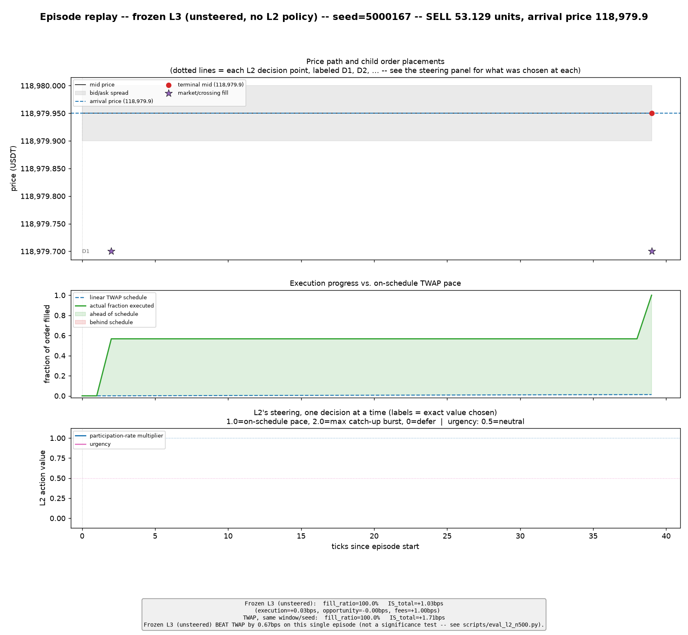
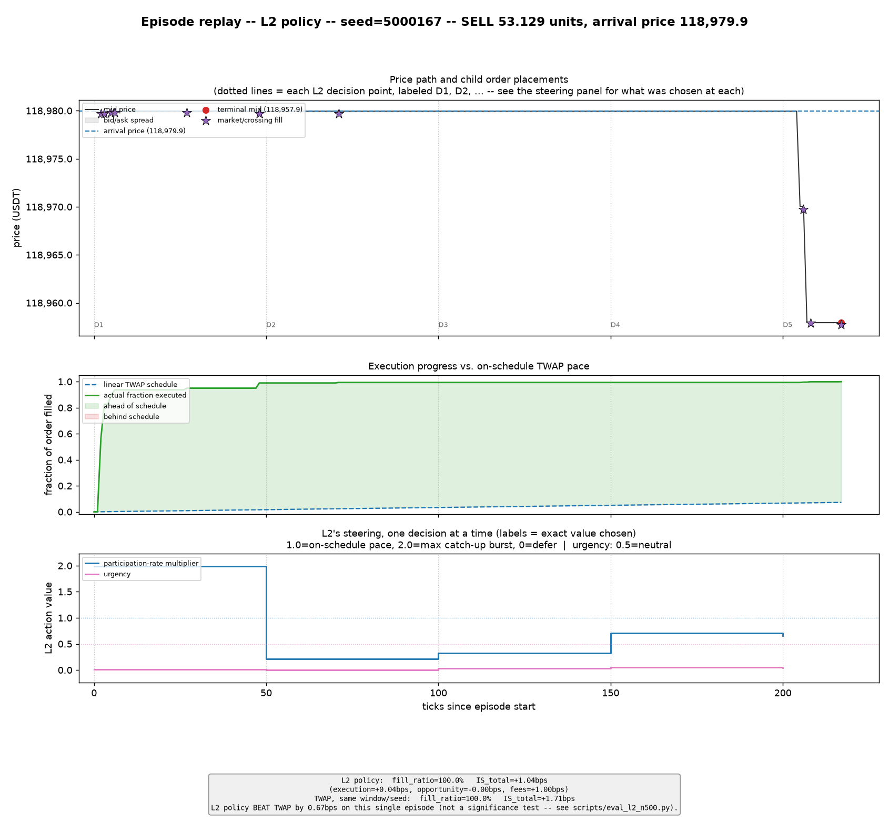

# lob-execution-hma

A hierarchical multi-agent RL system for limit-order-book trade execution, tested against real
BTCUSDT order-book data: a local-LLM macro analyst (L1), an RL strategist (L2, SAC), and an RL
executioner (L3, RecurrentPPO), each running on its own decision cadence above a custom
Gymnasium execution environment with a queue-position-aware fill simulator.

**Project complete.** Start with **[`docs/reports/PROJECT_FINAL_REPORT.md`](docs/reports/PROJECT_FINAL_REPORT.md)**
for the full writeup: what was built, headline results, engineering findings, negative results
with evidence, and scope/limitations. For a guided tour of the codebase itself — file-by-file,
function-level, with a dependency map — see **[`docs/PROJECT_ARCHITECTURE.md`](docs/PROJECT_ARCHITECTURE.md)**.
`docs/TRACK_STATUS.md` carries the full chronological working log behind it; `docs/reports/`
holds every per-track detail report.

## What it looks like

Same episode (seed, day, order quantity, arrival price) run twice — once with frozen L3
completely unsteered, once under L2's final policy — chosen as a near-median outcome for both
arms, not a cherry-picked one:

<table>
<tr>
<td></td>
<td></td>
</tr>
<tr>
<td align="center"><em>Frozen L3, unsteered — fills in 39 ticks at a flat price</em></td>
<td align="center"><em>Under L2's policy — front-loads, throttles down, finishes over 218 ticks</em></td>
</tr>
</table>

The two policies take very different paths through the same market window — L2 is actively
steering, not collapsed to a constant action — but this pair is illustrative of *mechanism*,
not the *aggregate* result: at real statistical power (n=500, paired tests), L2's steering
ties or loses to the unsteered baseline. See Section 5 of the final report for the full n=500
evidence, and `docs/reports/figures/` for the larger per-panel detail views (price path, fill
progress, and every steering decision individually labeled).
