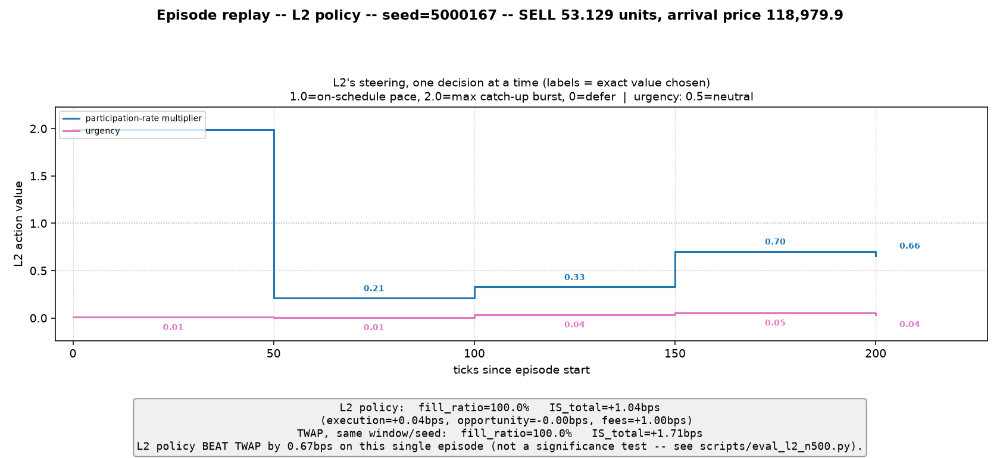

# Hierarchical Multi-Agent LOB Execution: Final Project Report

**Project window:** 2026-08-12 to 2026-08-29 (18 days, 129 commits, 195 tests).
**Data:** real BTCUSDT limit-order-book snapshots (Bybit historical L2 archive), 441 calendar
days, split chronologically train/val/test (below).

## Executive summary

This project built a three-tier hierarchical RL system for optimal trade execution — a local-LLM
macro analyst, an RL strategist, and an RL executioner — on real order-book data, and tested
whether each added tier improves on a simple time-weighted-average-price (TWAP) baseline.

**The honest headline: none of it beats TWAP.** The best executioner checkpoint ties TWAP on
execution quality (p=0.534/0.653 — statistically indistinguishable) while filling less completely
(91.9% vs 99.4%). Adding a learned strategist on top of that executioner never improves on it, in
any configuration tested — five different strategist checkpoints across two reward functions and
two discount factors, evaluated at n=500 with pre-registered significance bars, every one
statistically indistinguishable from or worse than doing nothing extra.

That is a legitimate, well-supported negative result, not a failure to find one. Getting to it
required finding and fixing two real simulator bugs, cutting environment throughput by roughly two
orders of magnitude, catching several near-misses where noise nearly got reported as signal, and
running a genuine diagnostic sequence that eliminated six separate explanations for the strategist's
negative result one at a time. Those are the project's real, durable contributions — detailed in
Sections 3, 5, and 6 below.

---

## 1. What was built

Three decision tiers sit above a custom Gymnasium execution environment (`LOBExecutionEnv-v0`),
each running on its own clock rather than one shared per-tick loop — the project calls this a
"frequency-decoupled control loop," and it is the single architectural fact that shapes most of
the implementation:

| Tier | Role | Model | Cadence | Decides |
|---|---|---|---|---|
| **L1 — Macro Analyst** | Reads market regime | A local LLM via Ollama (14B quantized model, chosen over a 32B alternative — no measured argument favored the larger model) | every 600 ticks | a structured risk assessment: regime, risk score, confidence, an urgency multiplier ∈ [0.5, 2.0] |
| **L2 — Strategist** | Paces execution | SAC (off-policy, continuous control) | every 50 ticks (~60 decisions per 3,000-tick episode) | a participation-rate multiplier (0 = defer, 1 = on-schedule TWAP, 2 = catch-up burst) and an urgency value passed down to L3 |
| **L3 — Executioner** | Places child orders | RecurrentPPO (LSTM policy) | every tick | order type (HOLD/LIMIT/MARKET/CANCEL_AND_REPLACE), price offset, size fraction |

Below all three, `LOBExecutionEnv-v0` runs a queue-position-aware fill simulator against real
order-book snapshots and computes execution-quality metrics (Implementation Shortfall via the
Perold decomposition, VWAP/TWAP delta, fill rate) from real fills, not an approximation.

**Data split** (chronological, mandatory — `src/data/split.py`, `data/splits/l2_bybit_btcusdt_split.json`):
train = 405 days (2024-04-18 to 2025-07-15), val = 18 days (2025-07-16 to 2025-08-02), test = 18
days (2025-08-03 to 2025-08-20).

**What was actually verified working**, and what was not:

- L3 was trained (RecurrentPPO, an original 20,000,000-step baseline plus several further
  retraining rounds — Section 3) and evaluated at real, well-powered sample sizes throughout.
- L2 was trained three separate times end-to-end (SAC, 1.6-2.0 million steps each, real order-book
  data) against a frozen L3, and evaluated at n=500 each time.
- The full three-tier orchestrator (`src/agents/orchestrator_graph.py`) was built and
  **correctness-verified** end-to-end: a dedicated integration test asserts L1 fires at exactly
  ticks 0/600/1200, L2 fires at the exact arithmetic sequence 0, 50, ..., 1200, and L3/env-step
  fires on every one of 1,250 ticks with no gaps (`docs/reports/l1l2l3_integration_correctness.md`).
  This is a **data-flow correctness result, not a training or performance result** — the report
  says so explicitly, and that integration run had L1 stubbed at the network boundary, not making
  real LLM calls.
- L1's real-LLM path was separately validated live against a real, unmocked Ollama call (two infra
  bugs and one schema-conformance bug found and fixed — Section 3), and an async wrapper was built
  so L1's ~1.6-14.6s LLM latency doesn't block the tick loop.
- **L1 was never trained against, and its live signal never reached L3 through the L2 training
  path that actually ran.** The orchestrator's `macro_tick()` function still takes a
  caller-supplied feature dict rather than calling `build_l1_feature_summary()` itself — a
  plumbing gap flagged early in the project and never closed. Every real L2 training run this
  project ran used stubbed L1 input dimensions. L1's contribution to execution outcomes is
  therefore **completely unmeasured** — it is validated as a working component, not as a
  value-adding one. This is stated as a limitation, not a footnote (see Section 7).

---

## 2. Headline results: every checkpoint evaluated at n=500

All numbers below are paired-seed evaluations (same 500 seeds, EVAL_SEED_BASE=5,000,000) on the
held-out **val** split (test split — see Section 7 — was never spent). Lower IS_total_bps is
better. Effect sizes (Cohen's d_z, paired) are reported alongside every p-value throughout this
project because a single significant test with a negligible effect size was repeatedly mistaken
for a real result early on (Section 6) — the project's own pre-registered bar requires **both** a
paired t-test and a Wilcoxon signed-rank test to agree (p<0.05, same direction) before a result
counts as real.

### L3 — Executioner (unsteered; TWAP itself = 0.889bps IS, fill_ratio=0.994)

| Checkpoint | IS_bps (std) | fill_ratio | vs TWAP diff | t-test p | Wilcoxon p | Verdict |
|---|---|---|---|---|---|---|
| **Frozen checkpoint (Arm A) — the one actually used by L2** | **0.994 (3.570)** | **0.919** | +0.105 | 0.534 | 0.653 | ties TWAP |
| 500k-step in-training snapshot | 1.025 (3.230) | 0.949 | +0.135 | 0.396 | 0.358 | ties TWAP |
| best-B heuristic (scripted, not RL) | 1.103 | 1.000 | +0.214 | 0.101 | 0.191 | ties TWAP |
| v1 (2M-step warm-start under fixed physics) | 1.261 (4.242) | 0.892 | +0.372 | **0.033** | 0.115 | disagreeing tests |
| Arm B (TWAP-baseline reward, treatment) | 1.341 (2.405) | 0.990 | +0.452 | **0.009** | **0.014** | significantly worse |
| Budget extension (Arm A + 2M more steps) | 1.237 (2.039) | 1.000 | +0.347 | **0.034** | **0.044** | significantly worse |

### L2 — Strategist steering the frozen L3 (TWAP-passthrough — frozen L3 alone, unsteered by
L2 — re-measured each round at ≈1.02-1.03bps; pure TWAP ≈0.889bps, both reproduced closely
every round as an internal sanity check)

| Checkpoint | Reward | γ | IS_bps | fill_ratio | vs TWAP-passthrough: d_z | t-test p | Wilcoxon p | Verdict |
|---|---|---|---|---|---|---|---|---|
| l2v1 final (original) | l3_passthrough | 0.995 | 1.233 | 0.921 | 0.075 | 0.096 | **0.007** | Wilcoxon-only sig., worse |
| l2v1 mid-run (step 499,980) | l3_passthrough | 0.995 | 1.177 | 0.914 | 0.049 | 0.270 | 0.110 | ties baseline |
| l2v2 final (step 1,999,992) | potential_is_shaping | 0.995 | 1.227 | 0.920 | 0.060 | 0.179 | **0.0045** | Wilcoxon-only sig., worse |
| **l2v2 pre-divergence (step 1,599,936) — best of everything tested** | potential_is_shaping | 0.995 | **1.117** | 0.924 | 0.032 | 0.468 | 0.295 | ties baseline |
| l2v3 final (step 1,599,936, never diverged) | potential_is_shaping | **0.983** | 1.169 | 0.916 | 0.048 | 0.280 | 0.118 | ties baseline |

**No checkpoint, on either track, ever clears the pre-registered bar of beating TWAP with both
tests agreeing.** The one nominal win — l2v1 final and l2v2 final each have a significant Wilcoxon
result — is in the *unfavorable* direction (L2 worse than doing nothing) and fails the "both tests
agree" requirement on the t-test side, so it counts as a loss under this project's own standard,
not a marginal win.

Two illustrative single-episode replays (same seed, matched day/quantity/arrival price, one run
unsteered and one run under L2's final gamma=0.983 policy) are in
`docs/reports/figures/` — see Section 5's callout for what they do and don't show.

---

## 3. The engineering findings — where the real wins are

### 3.1 Two fill-simulation physics bugs, and a more nuanced fill-ratio story than "bug fixed, fill jumped"

`LOBExecutionEnv`'s matching logic had two real bugs, both in `src/envs/lob_execution_env.py`,
found and fixed together in commit `a1d0390` (2026-08-19):

1. **`qty_at_price()`'s tolerance check never overrode `rtol`.** `np.isclose(prices, price,
   atol=TICK_SIZE/2)` left the default `rtol=1e-05` active. At BTCUSDT's ~$120,000 price scale,
   `rtol * price ≈ $1.2` — 24x looser than the intended $0.05 half-tick `atol`. Verified directly
   across 4,400 synthetic order placements at offsets -5..+5 ticks: **every single one matched,
   always at the touch, regardless of stated distance from the market.** Every resting limit order
   was effectively matching as if it were sitting at the best price. Fix: `rtol=0.0`.
2. **Crossing orders were never routed to a market-style fill.** `_place_limit()` had no crossing
   check — an order priced to cross the opposing side (common: offset ≥ +1 tick crossed ~100% of
   the time in the same sweep) fell through into the same buggy `q_ahead` lookup and became an
   ordinary resting "ghost" order instead of executing immediately. Fix: crossing prices now route
   through `walk_market_fill()`, same as an explicit market order.

**What actually happened to fill_ratio, precisely** (the project's own original 20,000,000-step
baseline checkpoint, `docs/reports/phase3_l3_baseline_milestone.md`):

| Stage | fill_ratio | IS_total_bps | What changed |
|---|---|---|---|
| 20M-step baseline, under the buggy physics | 0.590 | 0.632 | trained entirely under bugs #1+#2 |
| **Same, unretrained checkpoint, physics fixed** | **0.2015** | **-0.1999** | bug fix alone, no retraining |
| v1 (2M-step warm-start, correct physics from here on) | 0.892 | 1.261 | retrained under fixed physics |
| Arm A (frozen checkpoint, +1M more steps) | 0.919 | 0.994 | further retraining |
| Budget extension (+2M more, not recommended — Section 4) | 0.9998 | 1.237 | further retraining, quality plateaued |

The fix's **immediate** effect on the existing checkpoint was a *drop*, not a jump — fixing the
tolerance bug revealed that a large share of the original checkpoint's apparent fills had been
tolerance artifacts, not real matches. The climb to a workable fill rate (0.2015 → 0.892 → 0.919)
came entirely from **retraining under the corrected physics**, warm-started from the buggy-era
weights. Every reward-shaping variant tried afterward (the TWAP-baseline reward, the r_queue
split, the r_queue inversion) left fill_ratio in the same 0.89-1.00 band regardless of which was
active — the fill-ratio recovery is attributable to the physics fix plus retraining, not to any
reward design. That reallocation of credit is itself one of this project's more useful findings:
it is easy to mistake "the checkpoint got better" for "the reward got better," when the two are
governed by an entirely different part of the system.

### 3.2 Throughput: environment I/O, not gradient computation, was the real bottleneck

L2 could not be trained at all until this was addressed — extrapolated wall-clock for a real
2,000,000-step run started at **~5.5 days** (single env) and was still only **~1.84-2.38 days**
("marginal," not workable) after env-parallelization alone, the first fix tried.

- **`env.reset()` profiling** found 51.0% of wall-clock inside `reset()` itself (single env,
  2,083.8ms/call), with 77% of that traced via `cProfile` to an unvectorized Python loop calling
  `qty_at_price`/`np.isclose` roughly 14,400 times per reset. Vectorizing it cut
  `_precompute_feature_series` from ~498ms to ~19ms — **~25x**.
- **A second I/O round** measured that the 5 numeric/timestamp columns actually needed decode in
  ~48ms, while the bid/ask levels — stored as JSON strings in the original parquet format — alone
  accounted for **~97% of total decode cost** (~1,500-1,570ms). Row-group and predicate pushdown
  were both tried and confirmed dead ends against this format.
- **Converting the archive to a numeric (zstd-compressed) format** eliminated the JSON parsing
  entirely: `n_envs=8` throughput went from 12.575 to 31.808 decisions/sec — **2.53x** — dropping
  the 2,000,000-step extrapolation from 1.84 to 0.73 days and moving the go/no-go call from
  MARGINAL to WORKABLE.
- Naive env-parallelization alone was tried first and was insufficient on its own (9,729
  decisions/sec at n_envs=8 vs 5,651 at n_envs=1 — a real but sub-linear 1.72x/21.5% efficiency)
  — establishing directly that **the bottleneck was I/O, not compute**, before the format fix
  confirmed it.
- With every fix combined, the real training runs this project actually launched (n_envs=6)
  sustained ~19 decisions/sec and completed a full 2,000,000-step run in ~29 hours — inside the
  practical range the throughput work was chasing.

---

## 4. The negative results, each with its evidence

Presented as results, not failed attempts — each cost real effort and each answers a real
question the project needed answered.

- **CANCEL_AND_REPLACE has no exploitable value on this data.** An 18-configuration heuristic
  sweep's best-performing "REPLACE-active" scripted variant looked good at n=50 (best-B beating
  TWAP by -0.482bps) but, re-tested at n=500 (~83% power vs. the original 14.7%), the **sign
  flipped** — +0.214bps, i.e. worse than TWAP, and not significant either way (p=0.101/0.191). L3's
  own trained policy uses CANCEL_AND_REPLACE on ~0.36% of decisions. Near-zero usage is the correct
  learned behavior, not an undertrained policy failing to discover a useful action.
- **The r_queue MARKET/REPLACE reward split did not move REPLACE usage materially**, and a
  separate direction-inversion probe found no significant difference either way at n=50
  (underpowered, never re-tested at proper power — a genuinely open question this project leaves
  unresolved).
- **The TWAP-baseline variance-reduction reward was significantly worse than the matched
  control**, both tests agreeing: Arm B vs. TWAP p=0.0092/0.0140; the direct paired Arm B vs. Arm A
  comparison, mean diff +0.347bps, t p=0.0097, Wilcoxon p=0.0224, Cohen's d_z=0.116. It did reduce
  outcome variance exactly as designed (std 2.405 vs. Arm A's 3.570, Levene p<0.0001) — the
  variance-reduction mechanism worked; it just didn't help, and produced a behaviorally different
  policy (mean episode length dropped from 1,572 to 811 ticks), not merely a calmer version of the
  same one.
- **Budget extension (2,000,000 more steps from Arm A) is a plateau, not convergence.** Nominally
  worse than TWAP (p=0.034/0.044), but the decisive comparison is the direct paired test against
  the checkpoint it extended: t p=0.092, Wilcoxon p=0.230, **Cohen's d_z=0.076 — practically zero**.
  Eight in-training evaluation points show the best result at 500k steps into the extension, never
  bettered across the remaining 1,500,000 steps; one point at 1.25M steps briefly scored worse than
  TWAP. 97% of the small nominal gap to TWAP traced to just 10 of 500 episodes.
- **L2 steering has no edge over an unsteered, frozen L3 — anywhere it was tested.** Val split,
  unrestricted train split (relative comparison), three volatility strata on train days, three
  separate checkpoints across two reward functions and two discount factors — every comparison
  lands at "ties baseline" or "loses to baseline," never "beats baseline." Section 5 walks through
  how this was investigated, not just asserted.

---

## 5. The L2 diagnostic arc — the most instructive sequence in the project

This is worth telling as a narrative, because the value is in the reasoning, not just the
end state.

**Original result.** L2's first trained checkpoint (l2v1, 2,000,000 SAC steps against the frozen
L3) scored 1.233bps vs. TWAP-passthrough's 1.024bps — worse, with the two significance tests
disagreeing (t p=0.096, Wilcoxon p=0.0068) and a negligible effect size (d_z=0.075). Something was
wrong, but the size of the effect didn't say what.

**Diagnosis 1 — the wrong objective.** A direct measurement of L2's actual reward signal found
**85.6% of its net accumulated reward, and 75.4% of total signal magnitude, came from `r_stale`** —
a per-tick staleness penalty L2 does not control (it prices L3's own resting/replace timing, a
tick-level choice L2 never makes). **Terminal Implementation Shortfall — the metric L2 is actually
evaluated on — was 6.9% of net reward**, roughly a 12x mismatch between what L2 was being trained
to optimize and what it was being judged on. L2 was not failing to learn; it was learning the
wrong thing, accurately.

**Fix 1 — potential-based reward shaping.** A new reward, `Φ(t) = -κ · IS(fills so far, terminal
mid = current mid)`, `reward = Φ(t) - Φ(t-1)`, reuses the project's existing IS calculation
unmodified so telescoping to the real terminal IS is exact by construction, not approximate —
verified directly: summed shaped reward across 5 real episodes on the real frozen L3 matched
`-κ · terminal_IS` to within 1e-6. Signal composition flipped to 100% terminal-IS-derived by
construction (from 6.9%).

**Result 1.** A fresh 2,000,000-step run under the new reward (l2v2) ended at 1.227bps — still not
a win (Wilcoxon-only significant, p=0.0045, fails the "both agree" bar) — but a pre-divergence
checkpoint from the same run (step 1,599,936, see below) scored **1.117bps, the best result found
anywhere in this project, statistically indistinguishable from TWAP-passthrough** (neither test
significant). Real progress — from actively harmful to neutral — not a win.

**Diagnosis 2 — a diverging critic.** Both `gamma=0.995` runs (l2v1, l2v2) ended with the SAC
critic badly diverged (`critic_loss` reaching 7,230 and 11,100 respectively by their final steps,
from a stable ~0.05-0.13 baseline). The original headline negative result had been measured on a
policy whose critic had already been degrading for well over half the run.

**Fix 2 — a horizon-matched discount factor**, checked against the real code before running
anything: `gamma=0.995` gives an effective horizon of 200 decisions against episodes that run at
most ~60 decisions (`horizon_ticks / ticks_per_l2_decision = 3000/50`). The originally-proposed
mechanism — SAC bootstrapping value across a truncated episode boundary as if it hadn't ended —
was checked directly against the installed Stable-Baselines3 source and found **not to apply**:
`ReplayBuffer` already reads `info["TimeLimit.truncated"]` and correctly avoids zero-bootstrapping
at truncation. The corrected mechanism actually tested was TD-bootstrap error compounding under
near-flat discounting over a long single training run — a more standard failure mode, independent
of truncation handling. `gamma=0.983` (effective horizon ≈59, matching the episode) held
`critic_loss` flat in a 0.048-0.074 band across the **entire** 1,600,000-step budget — no
divergence at any point (l2v3). This is a real, useful finding — with the caveat that it is one
run per gamma value, not a seeded ablation.

**The decisive test.** Same reward, same 500 paired seeds, gamma the only variable: l2v3's
never-diverged final checkpoint vs. l2v2's pre-divergence checkpoint. Mean diff -0.053bps,
Cohen's d_z=-0.024 (an order of magnitude below even this project's previous "practically zero"
result), t p=0.592, Wilcoxon p=0.912 — **no detectable difference.** A numerically stable critic
did not produce a better policy than one that simply got caught before it diverged. Critic
divergence was real, and gamma=0.983 genuinely fixes it — but it was not the binding constraint on
execution quality.

**Every remaining explanation, checked and eliminated:**

1. *Wrong reward* — fixed (potential-based shaping); result improved from significantly-worse to
   statistically-tied, but never crossed into a win.
2. *Degraded critic* — fixed (gamma=0.983, held stable for the full budget); no change to outcome
   quality versus a pre-divergence checkpoint under the old gamma.
3. *Insufficient training* — checked across checkpoints from step 499,980 through step 1,999,992,
   three reward/gamma configurations; no step count, early or late, ever beat baseline, and
   several mid-run checkpoints outperformed their own later, more-trained selves.
4. *Regime mismatch* — checked via volatility-stratified evaluation on train days (calm/moderate/
   high buckets); no edge that strengthens with volatility (all |d_z| < 0.011).
5. *Policy collapse* — checked via action-distribution diagnostics; L2's participation-rate
   multiplier and urgency both show substantial within-episode variance (std 0.53/0.20), i.e. an
   actively steering policy, not one that collapsed to the constant, do-nothing action.
6. *Overfitting* — L2's own absolute IS numbers looked flat between train and val at first,
   suggesting "no learnable signal, not memorization." That read was wrong: both baselines had
   themselves shifted between splits (TWAP-passthrough 1.024→1.492, Pure TWAP 0.889→1.256 — train
   days are harder on average), which masked a real relative swing once corrected for (within-split
   L2-minus-baseline: val +0.209 vs. train -0.253, Welch's t p=0.0138) — see Section 6 for why this
   matters as its own lesson. But the volatility-stratified check — which isolates memorization
   from regime shift by staying entirely within train days — found no edge that strengthens on the
   specific days trained on, arguing against memorization as the driving explanation for that swing.

Six explanations, six real tests, six eliminations. What remains is the plain conclusion: **in
this environment, at this cadence, with this action space, L2 steering does not have an
exploitable edge over an unsteered, frozen L3** — not because any one identifiable thing was
broken, but because none of the things that plausibly could have been broken, were, once checked.

*Illustrative figures* (`docs/reports/figures/`, same seed run twice — once unsteered, once under
L2's final policy — same day, quantity, and arrival price both times, a near-median outcome for
both arms, chosen so as not to cherry-pick a favorable or unfavorable episode). Each run has a
combined overview (`l2_replay_frozen_seed5000167.png`, `l2_replay_l2v3steered_seed5000167.png`)
plus three larger single-panel versions for detail — full un-rounded prices, and every steering
decision individually labeled with its exact chosen value — under the `_price.png`, `_execution.png`,
and `_steering.png` suffixes of the same two base names.

The unsteered run fills the entire order in 39 ticks at a flat price (IS=+1.03bps); L2's policy
takes a very different path — front-loads aggressively (participation multiplier at its 2.0
ceiling for the first 50 ticks: D1 in the price/steering figures below), throttles down to 0.21x
by D2, then 0.33x and 0.70x at D3/D4, and finishes over 218 ticks while the market moves through a
real drawdown (IS=+1.04bps). Two visibly different execution strategies, statistically the same
outcome — a visual version of Section 5's central finding. These two episodes are illustrative of
mechanism, not representative of the aggregate — Section 2's n=500 tables are the actual evidence.

*Every one of L2's 5 decisions in this episode, with the exact participation-rate multiplier and
urgency value it chose at each — see `_price.png` for how those choices map onto where child
orders actually landed on the price path.*

---

## 6. Methodological lessons

Worth stating on their own because they generalize past this specific project.

- **n=50 oversold a result three separate times, each overturned once re-measured at n=500 with
  proper statistical power** (14.7% → ~83%): an 18-config heuristic sweep's best performer flipped
  sign entirely (-0.482bps at n=50 → +0.214bps at n=500); the original v1 checkpoint went from "not
  significant" (p≈0.83-0.90) to "significant" (t p=0.033); an in-training 500k-step snapshot's
  reading (0.686bps) understated its own real n=500 result (1.025bps) — each case is a live
  argument against trusting an underpowered training-time read, not a hypothetical caution.
- **Post-hoc selection bias compounds the n=50 problem.** The 18-config sweep case above wasn't
  just underpowered — it was also the *best of 18* screened configurations, so its promising-looking
  n=50 number was doubly likely to be noise: regression to the mean at proper power is exactly what
  should be expected of a screening winner, and that's exactly what happened.
- **Absolute comparisons can hide a real effect that a relative comparison reveals.** L2's own IS
  number looked flat between train and val (1.238 vs 1.233), which read as "no learnable signal
  either way." The real picture only appeared once both splits' own baselines were accounted for —
  they had moved too (train days are harder on average), so the *L2-minus-baseline* difference,
  not L2's raw number, is what actually diverges between splits (Welch's t p=0.0138). Comparing a
  model's raw score across conditions without accounting for how the reference point moved is a
  reusable trap, not specific to this project.
- **Uncommitted code silently governed a live training run.** An inline, unconditional inversion
  of the r_queue reward term, written during a probe and never reverted, stayed in the working tree
  uncommitted and was silently inherited by every subsequent L3 training run, including both arms
  of a later A/B test — meaning "Arm A reaches parity with TWAP, up from v1" is confounded with
  "and the reward direction flipped," never cleanly disentangled. It was eventually committed
  specifically so it could no longer happen invisibly. The same probe episode also silently
  overwrote the canonical `l3_executioner_v1.zip` checkpoint via a hardcoded final-save path — the
  true checkpoint is permanently lost, recovered only because a periodic in-training checkpoint
  saved 4 minutes earlier turned out to be numerically bit-identical. This project's later L2 work
  built an explicit overwrite guard (`--overwrite-canonical`, opt-in) directly in response, and
  that guard was verified working correctly across every real training run this project ran
  afterward.
- **A checksum citation went stale within hours.** A frozen-checkpoint sha256 was accurately
  reported in one report and had already drifted (the overwrite incident above) by the time a
  later document cited it from that report rather than re-checking. The fix that stuck for the rest
  of the project: verify checksums live, at the point of use, every time — never cite one from an
  earlier document, however recent.
- **A hypothesis's stated mechanism can be wrong even when its conclusion is right.** The
  gamma-ablation round's original proposed mechanism (SAC bootstrapping across a truncated episode
  boundary) was checked directly against the installed library source before launching a 1.6M-step
  run on it, and found not to apply — SB3 already handles that case correctly. The overall
  gamma-as-lever conclusion still held, but through a different, more standard mechanism. Checking
  a mechanism against the actual code before spending a day of compute on it is cheap; not checking
  it is not.

---

## 7. Scope and limitations — stated plainly, not softened

- **Val and test are both calm-skewed relative to train, on the same axis.** Val's mean realized
  volatility sits at train's own 23.7th percentile (spread: 27.4th, |return|: 32.8th; Mann-Whitney
  p=0.0004/0.0019/0.0065). Test is similar — 21.5th percentile on volatility. Val's entire realized-
  volatility range sits inside roughly train's bottom third (train's own max is over 5x val's).
  Every conclusion in this report holds **in calm-to-moderate conditions** and is unverified in the
  high-volatility regime — which is disproportionately where an execution algorithm's value
  proposition would actually be tested.
- **500 episodes drawn from 18 real days are not 500 independent samples for generalization
  claims** — they are 500 different (seeded) start times and order sizes layered onto a much
  smaller set of underlying price paths. The paired-seed methodology controls for this within a
  single comparison (same seeds, same days, across arms) but does not manufacture independence
  across days for external generalization.
- **A single training seed throughout, no replication runs.** No finding in this project's
  history — including the L3 TWAP-tie itself — has been confirmed under an independent seed. The
  gamma-ablation result in particular is one run per gamma value, explicitly flagged as such in
  Section 5.
- **The frozen L3 checkpoint's r_queue reward direction was never cleanly A/B'd against its
  original, non-inverted form** — only each compared separately to TWAP, at n=50, underpowered.
- **L1 was validated end-to-end but never trained against**, and its live signal path into L3
  through the FrozenL3Wrapper used for L2 training was never wired up (Section 1). The LLM tier's
  actual contribution to execution outcomes is completely unmeasured — not "found to be zero," but
  never tested. This is a more scoped decision than it looks, for two reasons. **First, an
  out-of-distribution confound**: the frozen L3 checkpoint was trained entirely with obs idx 17/18
  (`l1_risk_score`, `l1_confidence`) held at a constant stub value (0.0) — and `l1_risk_score` also
  directly scales L3's own inventory-holding reward term (`r_inv = -lam * (1 + max(0,
  l1_risk_score)) * (qty_remaining/qty_total)**2 * dt`, `src/envs/reward.py:302`, confirmed
  directly in the installed code). Feeding this checkpoint a live, non-zero L1 signal without
  retraining would not test "does L1 add value" — it would test "does this checkpoint handle an
  input distribution it never saw," a different and confounded question. A clean test requires
  retraining L3 itself with live L1 in the loop — LLM inference inside the training loop, at
  600-tick cadence, across every parallel worker — substantially more expensive than any run in
  this project, not a small follow-up. **Second, a timescale argument**: L1 produces one
  macro-regime read roughly every ~60s (600 ticks), while Implementation Shortfall over a single
  ~3,000-tick (~5-minute) episode is dominated by microstructure the macro read cannot see. L1's
  only channel to affect outcomes at all is through L2's steering — and L2, with a far more direct
  and fine-grained lever than L1 could ever supply, already had six independently tested
  explanations for its own negative result and found no edge under any of them (Section 5). Both
  points together make "L1 is unmeasured" a considered, scoped decision, not an oversight —
  closing it properly is a materially bigger undertaking than the wiring gap alone suggests.
- **The L2 training wrapper computes its target participation ratio once per 50-tick decision
  window** (`FrozenL3Wrapper.step()`, `src/envs/wrappers.py:289`, set once at the top of the
  method before the inner per-tick loop), **while a standalone L3 (no L2 in the loop) recomputes
  its own analogous ratio every tick** (`LOBExecutionEnv._compute_l2_target_slice_ratio()`,
  `src/envs/lob_execution_env.py:946-957`, called every tick via `_build_obs()`). This is a real,
  precisely located difference between how L3 is trained/evaluated standalone and how it behaves
  wrapped under L2 — its practical impact was not separately quantified in this project.
- **The test split was never spent, deliberately, on either track.** One L2 test-split
  confirmation run was pre-registered before execution (committed before the code that would run
  it, specifically so its terms couldn't be adjusted after seeing a result) and launched once — but
  was interrupted before completion, produced no output, and was never re-run. No result was ever
  observed, so nothing was learned from it and nothing needed to be discarded. L3 never attempted a
  test-split evaluation at all; every L3 result in this report is on val. The test split existed to
  confirm a candidate that had already cleared the pre-registered bar on val — no candidate, on
  either track, ever did. Leaving it unspent is the correct outcome of that design, not a gap.

---

## 8. What a next attempt should do differently

Grounded in what this project actually eliminated, not generic advice.

The strongest candidate is the data itself. The chronological split put essentially all of the
archive's volatile days in train and left val and test both calm — every negative result in this
report, including the well-diagnosed L2 steering result, was measured in a regime where a
sophisticated execution policy has the least room to add value over a naive schedule in the first
place. A **deliberately regime-stratified split** — holding out volatile days specifically, rather
than the most recent ones — or an archive extended backward far enough to capture genuine
high-volatility/crash regimes, would directly test the open question this project surfaced but
could not answer: does any of this generalize beyond calm markets? Given six other explanations
were checked and eliminated (Section 5), regime coverage is the remaining, untested, and most
promising lever — not a new reward, not more training budget, and not a bigger LLM.

One secondary item, lower priority but cheap given the infrastructure already built: replicate the
strongest single result (l2v2's pre-divergence checkpoint, or the gamma=0.983 stability finding)
under at least one independent seed before trusting it further.

A real L1-in-the-loop test is a separate, larger undertaking, not a cheap follow-up (Section 7's
out-of-distribution-confound and timescale reasoning) — it requires retraining L3 itself with live
LLM inference in the training loop, not merely closing the L2 wiring gap. Given L2's own richer,
higher-frequency lever already found no edge across six independently tested explanations, and
L1's only channel to affect outcomes runs through that same steering signal, this project's
judgment is that the expected value of that retraining does not currently justify its cost.
Recorded here as a documented, scoped open question — deliberately not pursued in this round.

---

## Where to look next

This report cross-references rather than duplicates the per-track detail. For full methodology,
exact numbers, and raw evaluation output, see (chronological within each track):

- **L1**: `docs/reports/l1l2l3_integration_correctness.md`, `docs/reports/l1_real_llm_validation.md`,
  `docs/reports/l1_async_threading_validation.md`.
- **L3**: `docs/reports/phase3_l3_baseline_milestone.md`, `docs/reports/l3_replace_value_probe.md`,
  `docs/reports/l3_twap_baseline_reward.md`, `docs/reports/l3_armA_budget_extension.md`,
  `docs/reports/l3_frozen_handoff.md`.
- **L2**: `docs/reports/phase4_l2_reconciliation_and_plan.md` (design/reconciliation),
  `docs/reports/l2_reward_redesign_proposal.md` (the credit-assignment diagnosis and shaping
  design), `docs/reports/l2v2_training_run_report.md`, `docs/reports/l2v2_checkpoint_evaluation_report.md`,
  `docs/reports/l2v3_gamma_ablation_training_run_report.md`, `docs/reports/l2v3_checkpoint_evaluation_report.md`.
- **Consolidated mid-project snapshot** (all three tracks, frozen 2026-08-24 before the L2
  throughput work below): `docs/reports/v1_master_state.md`.
- **`docs/TRACK_STATUS.md`** carries the full chronological working log for all three tracks, with
  every intermediate finding, dead end, and course correction in the order it actually happened.
